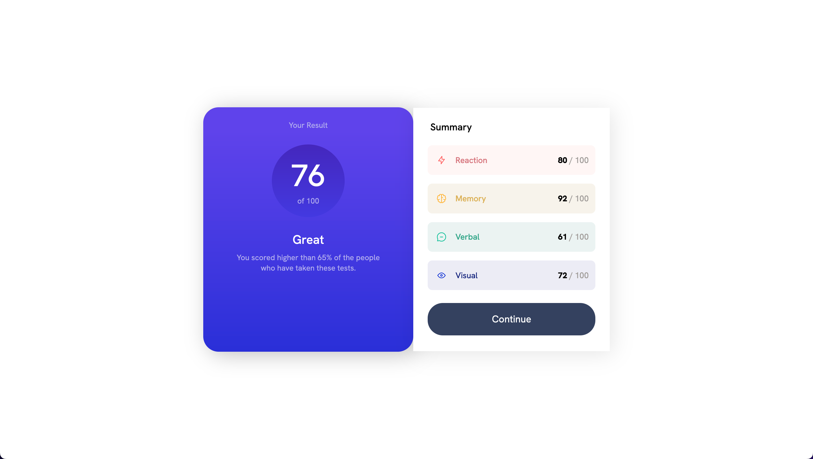

# Frontend Mentor - Results summary component solution

This is a solution to the [Results summary component challenge on Frontend Mentor](https://www.frontendmentor.io/challenges/results-summary-component-CE_K6s0maV). Frontend Mentor challenges help you improve your coding skills by building realistic projects.

## Table of contents

- [Overview](#overview)
  - [Screenshot](#screenshot)
  - [Links](#links)
- [My process](#my-process)
  - [Built with](#built-with)
  - [What I learned](#what-i-learned)

## Overview

### Screenshot

Mobile View:


Desktop View:



### Links

- Solution URL: [Add solution URL here](https://your-solution-url.com)
- Live Site URL: [Add live site URL here](https://your-live-site-url.com)

### My process

### Built with

- HTML
- CSS
- Flexbox

### What I learned

To make a div element's width and height shrink proportionally to the screen's width:

1. Set the `width` and height properties of the div to 100% so that it takes up the entire width and height of its parent element.
2. Set the `max-width` property of the div to a fixed value or a percentage value to set maximum width of the div element.
3. Set the `aspect-ratio` property of the div to the desired aspect ratio. For example, 1/1.

```css
.overall-score-container {
  width: 100%;
  height: 110%;
  max-width: 142px;
  aspect-ratio: 1/1;
}
```
